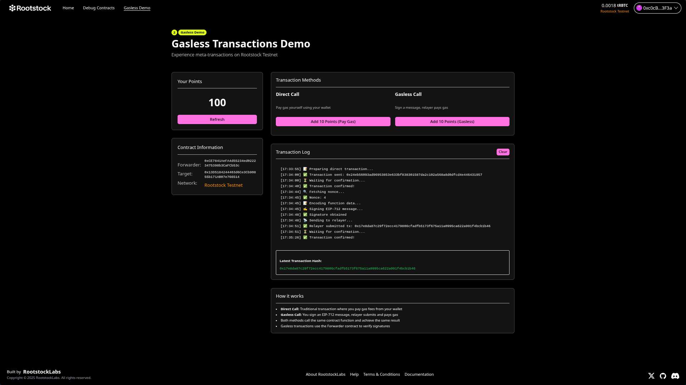

# Quick Start - Gasless Meta-Transactions

Get the gasless meta-transaction demo running in 5 minutes.



## Prerequisites

- Node.js >= 18.18
- Yarn
- 2 Rootstock Testnet wallets with tRBTC ([Get from faucet](https://faucet.rootstock.io/))

## 1. Install

```bash
git clone <this-repo>
cd rsk-meta-tx-relayer
yarn install
```

## 2. Deploy Contracts

```bash
# Configure deployer
cd packages/hardhat
cp .env.example .env
# Edit .env with your DEPLOYER_PRIVATE_KEY

# Deploy
cd ../..
yarn deploy
```

## 3. Get Addresses

```bash
yarn addresses
```

Copy the Forwarder and ExampleTarget addresses.

## 4. Configure Relayer

```bash
cd packages/relayer
cp .env.example .env
```

Edit `.env`:
```
RELAYER_PRIVATE_KEY=<your_relayer_wallet_key>
FORWARDER_ADDRESS=<from_step_3>
EXAMPLE_TARGET_ADDRESS=<from_step_3>
```

Install dependencies:
```bash
yarn install
```

## 5. Configure Frontend

```bash
cd ../nextjs
cp .env.example .env.local
```

Edit `.env.local`:
```
NEXT_PUBLIC_FORWARDER_ADDRESS=<from_step_3>
NEXT_PUBLIC_EXAMPLE_TARGET_ADDRESS=<from_step_3>
```

## 6. Run

Terminal 1 - Relayer:
```bash
yarn relayer
```

Terminal 2 - Frontend:
```bash
yarn start
```

## 7. Test

1. Visit http://localhost:3000/gasless
2. Connect wallet (Rootstock Testnet)
3. Try both buttons:
   - **Direct Call** - You pay gas
   - **Gasless Call** - Relayer pays gas

Done! 🎉

## Troubleshooting

**Relayer fails to start:**
- Ensure relayer wallet has tRBTC

**Frontend can't find contracts:**
- Check addresses in `.env.local` match deployed contracts

**Transactions fail:**
- Verify you're on Rootstock Testnet (Chain ID 31)