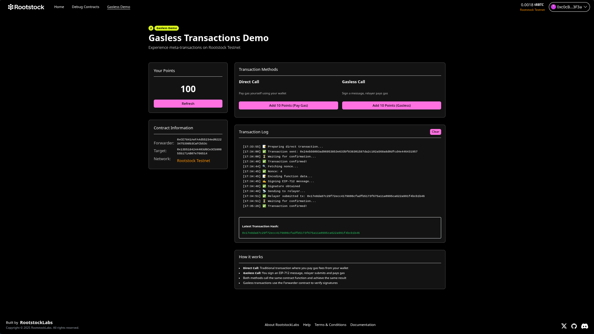

# Quick Start - Gasless Meta-Transactions

Get the gasless meta-transaction demo running in 5 minutes.



## What Are Gasless Transactions?

Gasless (or meta) transactions allow users to interact with smart contracts **without paying gas fees**. Instead, a relayer pays the gas on behalf of users, improving UX and removing the barrier of needing native tokens.

### Key Features

- ⛽ **Zero Gas for Users**: Relayer pays all transaction fees
- 🔒 **Secure**: EIP-712 typed signatures + OpenZeppelin's audited ERC2771Forwarder
- 🚀 **Production Ready**: 100% security compliance, comprehensive testing
- 📊 **Batch Execution**: Process multiple transactions with 35% gas savings
- 🛡️ **Rate Limiting**: Per-IP, per-address, and daily budget protection
- 🎯 **Configurable Allowlist**: Control which contracts can be called
- ✅ **Battle-Tested**: Using OpenZeppelin's industry-standard implementation

## Prerequisites

- Node.js >= 18.18
- Yarn
- 2 Rootstock Testnet wallets with tRBTC ([Get from faucet](https://faucet.rootstock.io/))

## 1. Install

```bash
git clone <this-repo>
cd rsk-scaffold
git checkout meta-tx-relayer
yarn install
```

## 2. Deploy Contracts

```bash
# Configure deployer
cd packages/hardhat
cp .env.example .env
# Edit .env with your DEPLOYER_PRIVATE_KEY and ROOTSTOCK_RPC_URL

# Deploy
cd ../..
yarn deploy
```

## 3. Get Addresses

```bash
yarn addresses
```

Copy the OZForwarder and ExampleTarget addresses.

## 4. Configure Relayer

```bash
cd packages/relayer
cp .env.example .env
```

Edit `.env`:
```
RELAYER_PRIVATE_KEY=<your_relayer_wallet_key>
FORWARDER_ADDRESS=<from_step_3>
ALLOWED_TARGETS=<from_step_3>  # Comma-separated list of allowed contract addresses
```

**Note**: You can specify multiple target contracts:
```
ALLOWED_TARGETS=0xAddress1,0xAddress2,0xAddress3
```

Install dependencies:
```bash
yarn install
```

## 5. Configure Frontend

```bash
cd ../nextjs
cp .env.example .env.local
```

Edit `.env.local`:
```
NEXT_PUBLIC_FORWARDER_ADDRESS=<from_step_3>
NEXT_PUBLIC_EXAMPLE_TARGET_ADDRESS=<from_step_3>
```

## 6. Run

Terminal 1 - Relayer:
```bash
yarn relayer
```

Terminal 2 - Frontend:
```bash
yarn start
```

## 7. Test

1. Visit http://localhost:3000/gasless
2. Connect wallet (Rootstock Testnet)
3. Try both buttons:
   - **Direct Call** - You pay gas
   - **Gasless Call** - Relayer pays gas

Done! 🎉

## Troubleshooting

**Relayer fails to start:**
- Ensure relayer wallet has tRBTC
- Check that `FORWARDER_ADDRESS` and `ALLOWED_TARGETS` are set correctly

**Frontend can't find contracts:**
- Check addresses in `.env.local` match deployed contracts
- Verify contracts are deployed with `yarn addresses`

**Transactions fail:**
- Verify you're on Rootstock Testnet (Chain ID 31)
- Check that the target contract is in the `ALLOWED_TARGETS` list
- Ensure relayer has sufficient tRBTC balance

**"Target contract not allowed" error:**
- Add the contract address to `ALLOWED_TARGETS` in relayer `.env`
- Restart the relayer after updating configuration

---

## Architecture Overview

```
User Wallet                    Relayer                    Blockchain
    |                             |                            |
    | 1. Sign EIP-712 message    |                            |
    |--------------------------->|                            |
    |                             |                            |
    |                             | 2. Validate signature      |
    |                             | 3. Check rate limits       |
    |                             | 4. Verify allowlist        |
    |                             |                            |
    |                             | 5. Execute meta-tx         |
    |                             |--------------------------->|
    |                             |                            |
    |                             |      6. Transaction        |
    | 7. Transaction confirmed    |<---------------------------|
    |<----------------------------|                            |
```

### Components

1. **OZForwarder.sol**: OpenZeppelin's ERC2771Forwarder contract
   - Verifies EIP-712 signatures
   - Manages nonces
   - Executes forwarded calls
   - Supports batch execution

2. **ExampleTarget.sol**: Demo contract with ERC2771Context
   - Extracts real sender from meta-transactions
   - Works with both direct and gasless calls

3. **Relayer Service** (`packages/relayer`):
   - Validates requests
   - Applies rate limiting
   - Pays gas fees
   - Tracks budgets

4. **Frontend** (`packages/nextjs`):
   - Signs EIP-712 messages
   - Sends requests to relayer
   - Displays transaction status

---

## Advanced Configuration

### Rate Limiting

Configure in `packages/relayer/.env`:

```bash
# Requests per IP per minute
RATE_LIMIT_PER_IP=10

# Requests per address per minute  
RATE_LIMIT_PER_ADDRESS=5

# Maximum concurrent requests
MAX_CONCURRENT_REQUESTS=20

# Daily gas budget (in wei)
DAILY_GAS_BUDGET=1000000000000000000  # 1 RBTC
```

### Multiple Target Contracts

Allow users to interact with multiple contracts:

```bash
ALLOWED_TARGETS=0xToken,0xStaking,0xGovernance,0xNFT
```

### Batch Execution

Send multiple transactions in one call for 35% gas savings:

```javascript
// Frontend example
const requests = [
  { request: req1, signature: sig1 },
  { request: req2, signature: sig2 },
  { request: req3, signature: sig3 }
];

await fetch('http://localhost:3001/relay/batch', {
  method: 'POST',
  body: JSON.stringify({ requests })
});
```

---

## Security Features

✅ **Signature Verification**: EIP-712 typed data signing  
✅ **Nonce Management**: Prevents replay attacks  
✅ **Deadline Protection**: Requests expire after deadline  
✅ **Rate Limiting**: 4-tier protection (IP, address, concurrent, budget)  
✅ **Allowlist**: Only approved contracts can be called  
✅ **Error Sanitization**: Internal errors not exposed to clients  
✅ **OpenZeppelin Audited**: Battle-tested, industry-standard code  

---

## Next Steps

- 📖 Read the [contracts README](./packages/hardhat/contracts/README.md) for technical details
- 🧪 Run tests: `yarn hardhat:test`
- 🚀 Deploy to mainnet: Update RPC URLs and deploy
- 🎨 Customize the frontend at `packages/nextjs/app/gasless`
- 📊 Monitor relayer logs for usage patterns

---

## Resources

- [EIP-712: Typed Structured Data](https://eips.ethereum.org/EIPS/eip-712)
- [EIP-2771: Secure Protocol for Native Meta Transactions](https://eips.ethereum.org/EIPS/eip-2771)
- [OpenZeppelin ERC2771Forwarder](https://docs.openzeppelin.com/contracts/5.x/api/metatx)
- [Rootstock Documentation](https://dev.rootstock.io/)