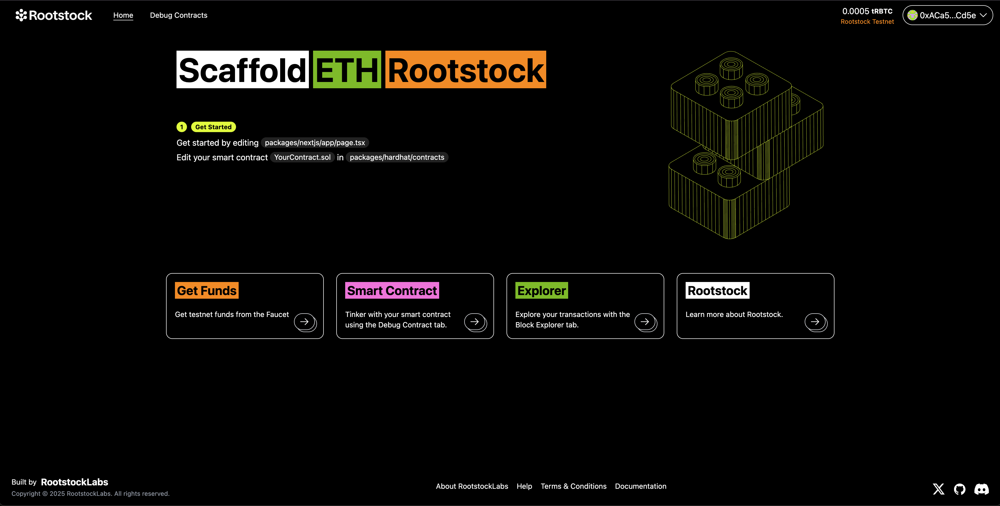

[](https://scorecard.dev/viewer/?uri=github.com/rsksmart/rsk-scaffold)
[](https://github.com/rsksmart/rsk-scaffold/actions?query=workflow%3ACodeQL)

# 🏗 Rootstock-Scaffold

<div align="center">

</div>

<h4 align="center">
  <a href="https://dev.rootstock.io">Rootstock Documentation</a>
  | <a href="https://github.com/rsksmart/rsk-scaffold/issues">Report Issue</a>
</h4>

⚙️ Built using NextJS, RainbowKit, Hardhat, Wagmi, Viem, and Typescript.

-   ✅ **Contract Hot Reload**: Your frontend auto-adapts to your smart contract as you edit it.
-   🪝 **[Custom hooks](https://dev.scaffoldeth.io/hooks/)**: Collection of React hooks wrapper around [wagmi](https://wagmi.sh/) to simplify interactions with smart contracts with typescript autocompletion.
-   🧱 [**Components**](https://docs.scaffoldeth.io/components/): Collection of common web3 components to quickly build your frontend.
-   🔥 **Burner Wallet & Local Faucet**: Quickly test your application with a burner wallet and local faucet.
-   🔐 **Integration with Wallet Providers**: Connect to different wallet providers and interact with the Rootstock network.



## Requirements

Before you begin, you need to install the following tools:

-   [Node (>= v18.18)](https://nodejs.org/en/download/)
-   Yarn ([v1](https://classic.yarnpkg.com/en/docs/install/) or [v2+](https://yarnpkg.com/getting-started/install))
-   [Git](https://git-scm.com/downloads)

## Quickstart

To get started, follow the steps below:

1. Clone this repo & install dependencies

```sh
git clone https://github.com/rsksmart/rsk-scaffold.git
```

2. Open the project directory and install dependencies

```sh
cd rsk-scaffold && yarn install
```

3. Setup `.env` file for Hardhat:

Make a copy of `.env.example` in `packages/hardhat` folder, name it `.env` and enter the respective values

```
DEPLOYER_PRIVATE_KEY=
ROOTSTOCK_RPC_URL=https://rpc.testnet.rootstock.io/YOUR_API_KEY_HERE
```

4. Deploying smart contracts on Rootstock:

Once the `.env` file is setup, you can now run the below command in your terminal.

```sh
yarn deploy
```

This command deploys a test smart contract to the Rootstock testnet network. The contract is located in `packages/hardhat/contracts` and can be modified to suit your needs. The `yarn deploy` command uses the deploy script located in `packages/hardhat/deploy` to deploy the contract to the network. You can also customize the deploy script.

5. Setup `.env` file for Next.js app (optional):

Make a copy of `.env.example` in `packages/nextjs` folder, name it `.env` and enter the respective values

```
NEXT_PUBLIC_WALLET_CONNECT_PROJECT_ID=
NEXT_PUBLIC_ROOTSTOCK_RPC_URL=https://rpc.testnet.rootstock.io/YOUR_API_KEY_HERE
```

6. On a second terminal, start your NextJS app:

```
yarn start
```

Visit your app on: `http://localhost:3000`. You can interact with your smart contract using the `Debug Contracts` page. You can tweak the app config in `packages/nextjs/scaffold.config.ts`.

**What's next**:

-   Edit your smart contract `YourContract.sol` in `packages/hardhat/contracts`
-   Edit your frontend homepage at `packages/nextjs/app/page.tsx`. For guidance on [routing](https://nextjs.org/docs/app/building-your-application/routing/defining-routes) and configuring [pages/layouts](https://nextjs.org/docs/app/building-your-application/routing/pages-and-layouts) checkout the Next.js documentation.
-   Edit your deployment scripts in `packages/hardhat/deploy`
-   Edit your smart contract test in: `packages/hardhat/test`. To run test use `yarn hardhat:test`

## Rootstock Network Configuration

This scaffold is configured for Rootstock Testnet by default. Here are the network details:

- **Network Name**: Rootstock Testnet
- **Chain ID**: 31
- **Currency**: tRBTC (Test Rootstock Bitcoin)
- **RPC URL**: `https://rpc.testnet.rootstock.io`
- **Explorer**: `https://explorer.testnet.rootstock.io`

### Getting Rootstock Testnet tRBTC

You can get testnet tRBTC from the [Rootstock Faucet](https://faucet.rootstock.io/).

## Documentation

Visit our [Rootstock docs](https://dev.rootstock.io) to learn how to start building with Rootstock.

## Contributing

We welcome contributions from the community. Please fork the repository and submit pull requests with your changes. Ensure your code adheres to the project's main objective.

## Support

For any questions or support, please open an issue on the repository or reach out to the maintainers.

# Disclaimer

The software provided in this GitHub repository is offered "as is," without warranty of any kind, express or implied, including but not limited to the warranties of merchantability, fitness for a particular purpose, and non-infringement.

- **Testing:** The software has not undergone testing of any kind, and its functionality, accuracy, reliability, and suitability for any purpose are not guaranteed.
- **Use at Your Own Risk:** The user assumes all risks associated with the use of this software. The author(s) of this software shall not be held liable for any damages, including but not limited to direct, indirect, incidental, special, consequential, or punitive damages arising out of the use of or inability to use this software, even if advised of the possibility of such damages.
- **No Liability:** The author(s) of this software are not liable for any loss or damage, including without limitation, any loss of profits, business interruption, loss of information or data, or other pecuniary loss arising out of the use of or inability to use this software.
- **Sole Responsibility:** The user acknowledges that they are solely responsible for the outcome of the use of this software, including any decisions made or actions taken based on the software's output or functionality.
- **No Endorsement:** Mention of any specific product, service, or organization does not constitute or imply endorsement by the author(s) of this software.
- **Modification and Distribution:** This software may be modified and distributed under the terms of the license provided with the software. By modifying or distributing this software, you agree to be bound by the terms of the license.
- **Assumption of Risk:** By using this software, the user acknowledges and agrees that they have read, understood, and accepted the terms of this disclaimer and assumes all risks associated with the use of this software.

To know more about Scaffold-ETH features, check out their [website](https://scaffoldeth.io).